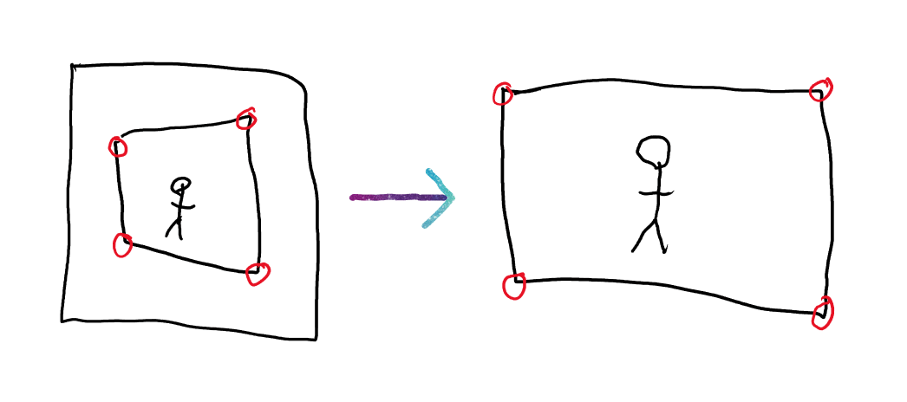

# qdcrop

Questダンス集会の写真が好きです。でも輪郭が好きではありません。qdcropは輪郭を外します。

I like pictures from Questダンス集会, but I don't like the border. qdcrop removes the border.

qdcrop looks for pixels that are different from neighboring pixels, and estimates a 3D rectangle based on the pixels nearest the four corners of the input image. The perspective transformation of the rectangle is reversed so the corners of the 3D rectangle snap to the corners of the output image.

This works well as long as there are no other pictures or objects on the edge of the input image.

## Usage

### Drag and drop

If you drag pictures onto the executable file, the borderless pictures will be saved into the same directory.

### Command line

    qdcrop image.png

Remove the border from image.png and save it as image.webp. image.webp will be saved in the current working directory, even if image.png is in another directory.

    qdcrop input.png -o output.webp

Remove the border from input.png and save it as output.webp. Regardless of the file extension, the format will always be webp.

    qdcrop image1.png image2.png

Remove the borders from image1.png and image2.png and save them as image1.webp and image2.webp.

    qdcrop image1.png image2.png -o out

Remove the borders from image1.png and image2.png and save them as out/image1.webp and out/image2.webp.

    qdcrop input1.png -o output1.webp input2.png -o output2.webp

Remove the borders from image1.png and image2.png and save them as output1.webp and output2.webp.

qdcrop does not limit the number of images that can be processed in a single batch, but Windows does have a limit on the length of the command line. If you try to process too many images at once the command line may be too long.
